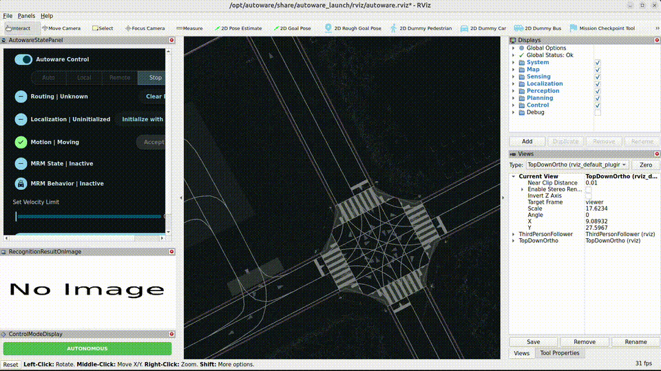

如果想要在本地端跑 Autoware，可以參考 Autoware 的[官方安裝教學](https://autowarefoundation.github.io/autoware-documentation/main/installation/)，他們有分兩種：從 source code 編譯，以及使用 OpenADKit 的容器。

然而，根據我的經驗，source code 編譯容易因為各種相依問題而無法成功，而且 OpenADKit 容器常常會有些小問題，更重要的是常常某些版本是有 bug 無法使用的。

最好的方式是直接使用自己確定可以運行的容器會比較好，這邊是官方提供的[容器列表](https://github.com/autowarefoundation/autoware/pkgs/container/autoware)。
裡面有非常複雜的各種容器相關性，可以參考[這張圖](https://github.com/autowarefoundation/autoware/tree/main/docker)來了解容器映像檔的相依行，但一般來說我們是使用 universe 即可，例如 `universe-1.7.1-amd64`。

若是還是實在太複雜，可以直接使用我建立的環境，會比較簡單一點。下面說明一下使用方式：

* 從 GitHub 抓取程式

```bash
git clone https://github.com/evshary/autoware_env.git
cd autoware_env
```

* 進入容器

```bash
./run_container.sh
```

* 下載地圖

```bash
gdown -O ~/autoware_map/ 'https://docs.google.com/uc?export=download&id=1499_nsbUbIeturZaDj7jhUownh5fvXHd'
unzip -d ~/autoware_map ~/autoware_map/sample-map-planning.zip
```

* 調整 CycloneDDS 的網路設定

```bash
sudo ip link set lo multicast on
sudo sysctl -w net.core.rmem_max=2147483647
sudo sysctl -w net.ipv4.ipfrag_time=3
sudo sysctl -w net.ipv4.ipfrag_high_thresh=134217728
```

* 運行 planning simulation

```bash
source /opt/autoware/setup.bash
export RMW_IMPLEMENTATION=rmw_cyclonedds_cpp
export CYCLONEDDS_URI=`pwd`/config/cyclonedds.xml
ros2 launch autoware_launch planning_simulator.launch.xml map_path:=$HOME/autoware_map/sample-map-planning vehicle_model:=sample_vehicle sensor_model:=sample_sensor_kit
```

* 啟動後，我們可以嘗試簡單的導航
    * 設定 2D Pose Estimation，可以設在地圖上的左車道 (這是日本的交通規則，方向跟台灣相反)
    * 點選 2D Goal Pose，決定抵達目的地
    * 點選左邊 panel 的 Auto，就會開始導航了



* planning simulation 是 Autoware 中最簡單測試導航功能模擬器，詳細可以參考[官方的操作教學](https://autowarefoundation.github.io/autoware-documentation/main/tutorials/ad-hoc-simulation/planning-simulation/#lane-driving-scenario)
