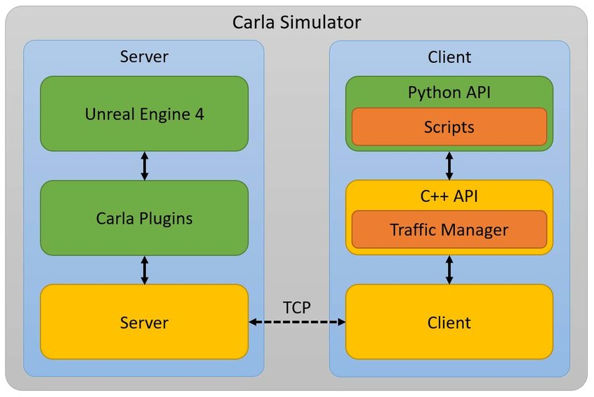

# Autoware 模擬

目前 Autoware 適用的模擬器有這幾種

* [AWSIM](https://tier4.github.io/AWSIM/GettingStarted/QuickStartDemo/)
    * Tier4 提出的模擬器，基於 Unity 的架構
    * 目前 Autoware 官方最主要使用的模擬器
* [MORAI](https://www.morai.ai/)
    * MORAI Inc. 這家韓國公司所提出，有提供 trial license，但非 open source
* [Carla](https://carla.org/)
    * 常用的汽車開源模擬器，使用 Unreal Engine
    * 雖然 Autoware 官方沒有正式支援，但是社群有不少人有開發 bridge 來連接 Autoware
* [LGSVL](https://www.svlsimulator.com/)
    * LG 提出，Autoware 是用這個，但已經 phase out，現在 Autoware 也不支援了

## Carla

Carla 是專門用在 Autonomous Driving Systems 的開源模擬器，底層是用 Unreal Engine，然後用 OpenDrive 來定義道路和城市，並且可用 C++ / Python 來控制模擬

Carla 支援 ROS 和 Autoware

* [官方網站](https://carla.org/)
* [官方文件](https://carla.readthedocs.io/en/latest/)

### Architecture


[圖片來源](https://www.researchgate.net/figure/Carla-Simulator-System-Architecture-Pipeline_fig4_350000830)

### Installation & usage

來自[官網的教學](https://carla.readthedocs.io/en/latest/start_quickstart/)

#### Installation

1. 從[GitHub](https://github.com/carla-simulator/carla/blob/master/Docs/download.md)下載三個 Carla 相關檔案
2. 解壓縮 `Carla_<version>.tar.gz`，然後把其他兩個檔案放入底下的 Import folder
3. 執行 `./ImportAssets.sh`
4. 下載 client library: `pip3 install carla`

#### Usage

1. 跑模擬世界：`./CarlaUE4.sh`
2. 安裝 example 中的相依套件

   ```bash
   cd PythonAPI/examples
   python3 -m pip install -r requirements.txt
   ```

3. 產生 traffic： `python3 generate_traffic.py`
4. 人工控制：`python3 manual_control.py`
5. 外部改設定

   ```bash
   cd PythonAPI/util
   python3 config.py --map Town05
   ```

### Carla Concept

可參考[官網](https://carla.readthedocs.io/en/0.9.13/core_concepts/)

* world & client:
    * world 只會有一個，可以放入 actor，並且有改變天氣的能力
    * client 是讓使用者可以取得資訊或修改模擬的模組，使用 IP 連接 server，可以有多個 client
* actors & blueprints
    * actors 是模擬內的角色，如車子、行人、感測器、紅綠燈...
    * blueprint 是 actor 的模板，定義 actor 有哪些性質或功能
* maps & navigation
    * 用來描述城市和道路，目前有 8 張地圖，使用 OpenDRIVE 1.4
* sensors & data
    * sensor 可以從模擬中取得資料

## Carla with Autoware

* Carla 官方的 Autoware Bridge 只有支援 `Autoware.AI` / `Autoware.Auto`
    * 可參考[程式碼](https://github.com/carla-simulator/ros-bridge/tree/master/carla_ad_agent)和[使用教學](https://carla.readthedocs.io/projects/ros-bridge/en/latest/carla_ad_demo/)
* Autoware 社群[支援列表](https://autowarefoundation.github.io/autoware-documentation/main/tutorials/ad-hoc-simulation/digital-twin-simulation/carla-tutorial/)
