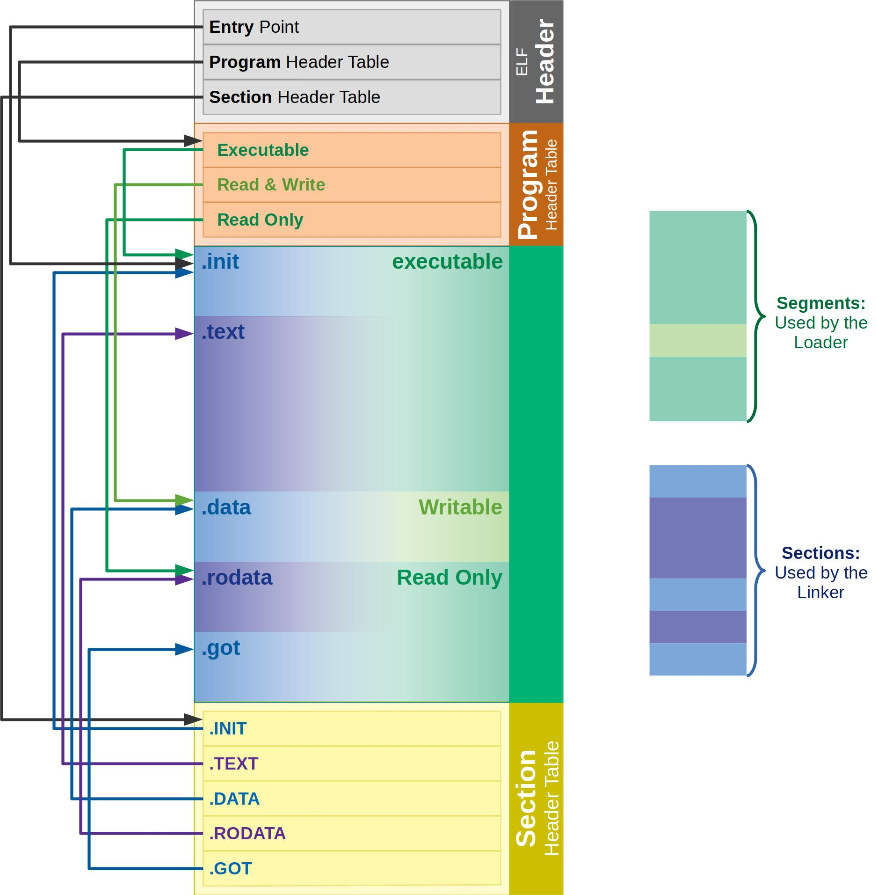

Binary 分析是在沒有原始碼，或需要確認編譯結果時，從執行檔、函式庫或 firmware image 中取得資訊的方法。
分析時通常會先辨識檔案格式與 CPU 架構，再逐步查看檔案結構、symbols、字串及組合語言；若需要理解較複雜的程式邏輯，才使用反編譯或逆向工程工具。

## ELF 架構

ELF (Executable and Linkable Format) 是 Linux 與其他 Unix-like 系統常見的 binary 檔案格式，可以用來表示執行檔、object file、shared library 與 core dump。



圖片來源：[ELF Format](https://blog.mygraphql.com/zh/notes/low-tec/elf/elf-format/)

ELF 大致由以下幾個部分組成：

* ELF header：位於檔案開頭，記錄 CPU 架構、位元數、endian、entry point，以及其他表格的位置。
* Program header table：說明程式執行時哪些資料要載入記憶體，以及各 segment 的權限與位址。
* Sections：依用途保存程式內容，例如 `.text` 存放程式碼、`.data` 存放已初始化資料、`.bss` 代表未初始化資料，`.rodata` 則存放唯讀資料。
* Section header table：描述檔案中的 sections，主要供 linker 與分析工具使用。

Sections 是從 linking 與靜態分析的角度分類檔案內容；segments 則是從程式執行的角度，描述資料如何被載入記憶體。一個 segment 可以包含多個 sections。

## 常用工具

| 目的 | 建議工具 | 簡單說明 |
| --- | --- | --- |
| 確認檔案與 CPU 架構 | `file` | 辨識檔案格式、位元數、endian 與 CPU 架構，適合作為分析的第一步。 |
| 查看 ELF 結構 | `readelf` | 查看 ELF header、sections、segments、symbols 與 dynamic linking 資訊。 |
| 快速反組譯 | `objdump` | 將 machine code 反組譯為組合語言，也能查看 section 與 symbol 資訊。 |
| 查看 symbols | `nm` | 列出 binary 或 library 中的 symbols，用來尋找函式與 global variables。 |
| 搜尋字串 | `strings` | 找出可顯示的文字，例如錯誤訊息、路徑、網址或版本資訊。 |
| 拆解 firmware image | Binwalk | 辨識並擷取 firmware 中的檔案系統、壓縮檔及內嵌資料。 |
| 深入分析與 decompile | Ghidra | 提供圖形化的 disassembly、decompiler、cross-reference 與控制流程分析。 |
| 自動化 disassembly | Capstone | 可嵌入程式或腳本的 disassembly framework，適合批次與自動化分析。 |
| 命令列逆向分析 | radare2 / Rizin | 提供命令列介面的 disassembly、debug、搜尋與程式流程分析功能。 |

## 基本分析流程

拿到未知 binary 時，可以依照下列順序開始分析：

1. 使用 `file` 確認檔案格式、CPU 架構、位元數與 endian。
2. 如果是 ELF，使用 `readelf` 查看 headers、sections 與 dynamic dependencies。
3. 使用 `nm` 與 `strings` 尋找可辨識的函式名稱、錯誤訊息及其他線索。
4. 使用 `objdump` 快速查看重要函式的組合語言。
5. 若檔案是 firmware image，先使用 Binwalk 尋找並擷取內嵌內容。
6. 需要追蹤控制流程或還原程式邏輯時，再使用 Ghidra、radare2 或 Rizin 深入分析。
7. 需要批次處理大量 binary 時，可以使用 Capstone 撰寫自動化分析工具。

以下是一組常見的基本指令：

```bash
# 辨識檔案格式與 CPU 架構
file program

# 查看 ELF header、sections 與 program headers
readelf -h program
readelf -S program
readelf -l program

# 查看 dynamic dependencies 與 symbols
readelf -d program
nm -C program

# 搜尋字串與反組譯
strings -a program
objdump -d program
```

如果 binary 已經被 stripped，許多 symbol 名稱會消失，但仍可以透過字串、imported functions、cross-references 與控制流程推測程式行為。
分析不可信的 binary 時，應避免直接在主機上執行，建議使用隔離的虛擬機、container 或 sandbox，並先確認檔案來源與 hash。
