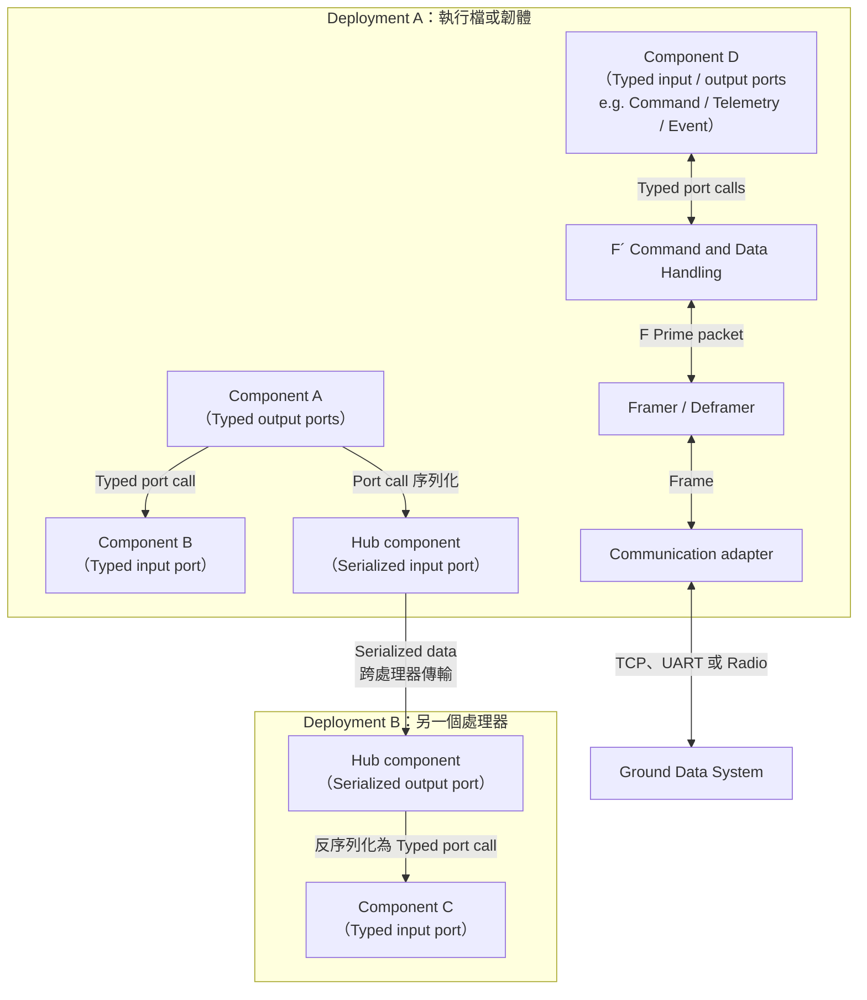

# F´（F Prime）

F´（讀作 F Prime）是由 NASA 噴射推進實驗室（JPL）開發的開源飛行軟體與嵌入式系統框架，主要使用 C++。它最初為太空任務設計，也適合用於 CubeSat、SmallSat、太空機器人（如直升機、機械臂）、儀器及其他需要可靠軟體架構的嵌入式系統。

F´ 採用元件化架構，透過定義清楚的介面連接各個元件，並提供執行緒、訊息佇列、作業系統抽象層、遙測、命令處理及事件記錄等常用功能。
開發者也能使用 FPP（F Prime Prime）描述元件與系統拓樸，再自動產生部分 C++ 程式碼，減少重複工作。
F´ 的價值在於提供一套專為太空任務設計的框架，避免開發者每次都要從頭設計與實作常見功能。

## 為何 NASA 要開源 F´

F´ 開源的原因包括：

* 降低大學或小型太空任務的開發門檻。
* 讓政府機構、學校、企業與國際組織共同使用、檢視及改進框架。
* 透過社群貢獻支援更多硬體平台與使用情境。
* 讓學術單位能將實際的飛行軟體框架用於教學，培養相關人才。

## Component 的種類

F´ component 依執行方式分為三種：

* **Passive component**：沒有自己的執行緒與訊息佇列，由呼叫端的執行緒直接執行。
* **Queued component**：有訊息佇列但沒有自己的執行緒，必須由其他 component 觸發才會處理佇列中的工作。
* **Active component**：有自己的執行緒與訊息佇列，可以獨立處理非同步工作。

Component 也可以依職責分成 application、manager、driver 與 service。Application 實作任務邏輯，manager 管理裝置或子系統，driver 操作底層硬體，而 service 提供命令分派、遙測、事件記錄等可重複使用的功能。這些是架構上的職責分類；每個 component 本身仍會選擇 passive、queued 或 active 其中一種執行方式。

## F´ 如何運行

一個 F´ deployment 會將選用的 framework、service、driver 與自訂 component 組合起來，最後編譯及連結成一個目標程式。開發時，它可以是在 Linux 或 macOS 上直接啟動的執行檔；部署到硬體時，則可以成為在 Linux、VxWorks、FreeRTOS、Zephyr 等作業系統上運行的程式，或是不依賴作業系統的 bare-metal 韌體映像檔。

因此 F´ 不像 ROS 2 一樣預設由許多可在執行期間動態發現的 process 與 node 組成。一般情況下，一個 deployment 內的 component 會被編譯進同一個程式，其實例和連接關係也在 topology 中預先定義。如果系統包含多個處理器，則可以在不同處理器上運行不同的 deployment，再透過通訊鏈路連接。

## 整體架構

圖中的 Deployment A 與 Deployment B 是彼此獨立的目標程式。大部分 component 通訊發生在同一個 deployment 內；跨處理器或連接地面系統時，通常需要進一步序列化與封包化。
圖中的 F´ Command and Data Handling 將命令分派、遙測與事件處理等標準 component 收合成一個區塊，雙向箭頭則分別代表 command 上行，以及 telemetry、event 與 command response 下行。

## F´ 如何傳遞資料

F´ 依資料傳遞的範圍提供不同層次的介面：

* **Typed port**：component 之間最常用的介面。Port 會明確定義參數型別，output port 只能連接相容的 input port，因此編譯時就能檢查介面是否正確。在同一個 deployment 中，這類通訊通常會成為程式內的函式呼叫或訊息佇列操作。
* **Serialized port**：將 typed port 的參數序列化成通用的位元組 buffer，讓中間的轉送元件不需要知道實際資料型別。它常用於通用路由、資料儲存，或透過 hub 將 port call 傳到另一個處理器；接收端可再將 buffer 反序列化回原本的 typed port 參數。
* **F Prime packet**：用於 deployment 與 Ground Data System（GDS）之間的 uplink 與 downlink，例如 command、telemetry、event 及 file data。Packet 會帶有識別資料種類的 descriptor，再由 framing 元件包成可傳輸的 frame，最後經由 TCP、UART 或無線電等通訊介面送出。F´ 也能改用 CCSDS 或任務自訂的封包與 framing 格式。

簡單來說，typed port 負責程式內 component 之間的強型別互動；serialized port 讓 port call 可以通過不理解具體型別的轉送元件或跨越處理器邊界；F Prime packet 則負責與地面系統交換任務資料。

## 常用資源

* [F´ 官方網站](https://fprime.jpl.nasa.gov/)：功能介紹、最新消息與專案入口。
* [F´ 官方文件](https://fprime.jpl.nasa.gov/latest/docs/)：教學、使用手冊、操作指南與 API 參考資料。
* [安裝指南](https://fprime.jpl.nasa.gov/latest/docs/getting-started/installing-fprime/)：開發環境需求及安裝步驟。
* [F´ GitHub](https://github.com/nasa/fprime)：原始碼、版本發布與問題追蹤。
* [F´ GitHub Discussions](https://github.com/nasa/fprime/discussions)：使用問題與社群討論。
* [FPP 文件](https://nasa.github.io/fpp/)：FPP 建模語言的介紹與使用指南。
* [F Prime cheatsheet](https://fprime.jpl.nasa.gov/cheatsheet.pdf)：F Prime 的小抄，說明一些基本概念。

初次接觸時，建議先完成官方文件中的 HelloWorld 教學，再進一步了解元件、連接埠、拓樸及 Ground Data System（GDS）。
