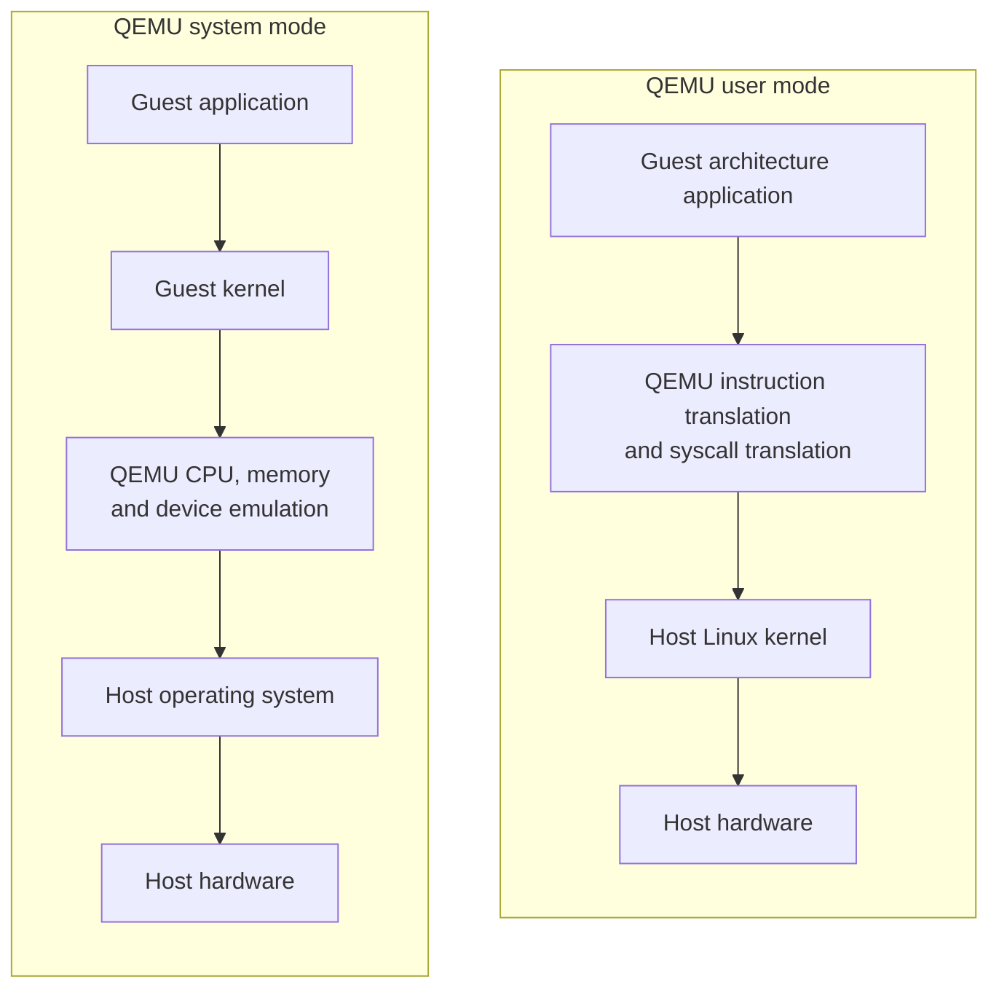

QEMU 是一個開源的 machine emulator 與 virtualizer，可以在不同 CPU 架構之間執行程式，也可以模擬一台完整的電腦。
例如，我們可以在 x86-64 Linux 上執行 ARM64 Linux 程式，或啟動包含 ARM64 CPU、記憶體與虛擬周邊設備的完整系統。

QEMU 最常見的兩種使用模式是 user mode 與 system mode。選擇時的關鍵在於：我們只需要執行某個程式，還是需要一個包含 kernel 與周邊設備的完整系統。

## 執行架構



User mode 只翻譯 guest 程式的 CPU 指令，程式發出 system call 時，QEMU 會將它轉換後交給 host Linux kernel 處理。
System mode 則會提供虛擬 CPU、記憶體與周邊設備，guest kernel 會像在真實機器上一樣管理這些資源。

## User mode 與 system mode 比較

| 項目 | User mode | System mode |
| --- | --- | --- |
| 模擬範圍 | 單一 Linux userspace 程式 | 完整機器與作業系統 |
| Guest kernel | 不需要，使用 host kernel | 需要自行提供 |
| 周邊設備 | 不模擬 | 可模擬 disk、network、serial port 等設備 |
| 啟動速度 | 快，直接執行目標程式 | 慢，需要完成 boot process |
| 環境準備 | 目標程式與所需 libraries | Kernel、root filesystem 與虛擬硬體設定 |
| 隔離性 | 程式仍共用 host kernel | Guest 有獨立 kernel |
| 常見用途 | 交叉架構測試、binary analysis、fuzzing | OS 開發、driver 測試、firmware 與 embedded system 模擬 |
| 常用指令 | `qemu-aarch64`、`qemu-arm`、`qemu-riscv64` | `qemu-system-aarch64`、`qemu-system-arm`、`qemu-system-x86_64` |

如果只是要測試不同 CPU 架構的 Linux command-line 程式，user mode 通常比較簡單。
當目標依賴特定 kernel、driver、啟動流程或周邊設備時，才需要使用 system mode。

## User mode 實作

以 x86-64 Ubuntu host 執行 ARM64 Linux 程式為例，先安裝 QEMU user mode 與 ARM64 cross compiler：

```bash
sudo apt update
sudo apt install qemu-user gcc-aarch64-linux-gnu
```

建立一個簡單的 C 程式，並將檔案存為 `hello.c`：

```c
#include <stdio.h>

int main(void) {
    puts("Hello from ARM64");
    return 0;
}
```

使用 ARM64 cross compiler 產生 statically linked ELF，再交給 `qemu-aarch64` 執行：

```bash
aarch64-linux-gnu-gcc -static hello.c -o hello-aarch64
file hello-aarch64
qemu-aarch64 ./hello-aarch64
```

執行結果如下：

```text
Hello from ARM64
```

Static linking 會將所需 library 放入 binary，因此 QEMU 不需要另外尋找 ARM64 shared libraries。
如果要執行 dynamically linked binary，可以用 `-L` 指定目標架構的 library root：

```bash
aarch64-linux-gnu-gcc hello.c -o hello-aarch64-dynamic
qemu-aarch64 -L /usr/aarch64-linux-gnu ./hello-aarch64-dynamic
```

QEMU user mode 也可以透過 `-strace` 顯示 guest 程式發出的 system calls，適合用來理解程式行為或追查執行問題：

```bash
qemu-aarch64 -strace ./hello-aarch64
```

## System mode 實作

System mode 需要準備與目標架構相容的 kernel 與 root filesystem。先安裝 ARM system emulator：

```bash
sudo apt update
sudo apt install qemu-system-arm
```

QEMU 可以模擬多種 machine，下列指令可以查看 ARM64 支援的 machine 與 CPU：

```bash
qemu-system-aarch64 -machine help
qemu-system-aarch64 -cpu help
```

`virt` 是 QEMU 提供的通用 ARM virtual platform，適合啟動 Linux，不對應某一塊真實開發板。

### 下載 Alpine Linux kernel 與 rootfs

這裡使用 Alpine Linux 官方提供的 ARM64 netboot files：

* `vmlinuz-virt`：適用於 virtual machine 的 ARM64 Linux kernel。
* `initramfs-virt`：開機初期使用的 root filesystem，包含建立系統環境所需的 init scripts 與基本工具。

下列 URL 使用 `latest-stable`，可以自動取得最新的 stable release：

```bash
mkdir qemu-alpine
cd qemu-alpine

curl --fail --location \
  --output vmlinuz-virt \
  https://dl-cdn.alpinelinux.org/alpine/latest-stable/releases/aarch64/netboot/vmlinuz-virt

curl --fail --location \
  --output initramfs-virt \
  https://dl-cdn.alpinelinux.org/alpine/latest-stable/releases/aarch64/netboot/initramfs-virt
```

如果需要可重現的開發環境，應將 URL 中的 `latest-stable` 改為固定版本，避免 kernel 與 userspace 在新版本發布後改變。

### 啟動 Alpine Linux

Alpine netboot initramfs 會使用 DHCP 取得 IP，再從官方 repository 下載基礎套件與 `modloop-virt`。因此 QEMU 需要提供虛擬網路卡與 user-mode network backend：

```bash
qemu-system-aarch64 \
  -machine virt \
  -cpu cortex-a57 \
  -m 1024 \
  -nographic \
  -kernel vmlinuz-virt \
  -initrd initramfs-virt \
  -append "console=ttyAMA0 ip=dhcp alpine_repo=https://dl-cdn.alpinelinux.org/alpine/latest-stable/main modloop=https://dl-cdn.alpinelinux.org/alpine/latest-stable/releases/aarch64/netboot/modloop-virt" \
  -netdev user,id=net0 \
  -device virtio-net-pci,netdev=net0
```

第一次啟動時需要等待套件與 kernel modules 下載完成。看到下列訊息就代表已經成功進入 Alpine Linux：

```text
Welcome to Alpine Linux

Kernel 6.x.x-virt on aarch64 (/dev/ttyAMA0)
localhost login:
```

輸入帳號 `root` 即可登入，預設不需要密碼。登入後可以確認 guest 的 CPU 架構與 kernel：

```bash
uname -m
uname -a
cat /etc/alpine-release
```

這個範例的 rootfs 建立在 RAM 中，適合快速練習 QEMU system mode，但重新啟動後不會保留修改。如果需要 persistent storage，可以另外建立 virtual disk，再在 guest 中使用 `setup-alpine` 安裝系統。

主要參數的用途如下：

* `-machine virt`：使用 QEMU ARM virtual platform。
* `-cpu cortex-a57`：選擇要模擬的 CPU model。
* `-m 1024`：分配 1024 MiB guest memory。
* `-nographic`：不開啟圖形視窗，將 serial console 連接到當前 terminal。
* `-kernel`：直接載入 Linux kernel image。
* `-initrd`：載入開機初期使用的 initramfs。
* `-append`：傳遞 kernel command line，設定 serial console、DHCP、package repository 與 kernel module image。
* `-netdev` 與 `-device`：建立 user-mode network backend 與 virtio network device。

在 `-nographic` 模式中，可以按 `Ctrl-A` 後再按 `X` 結束 QEMU。

## 加速方式

QEMU 可以透過 dynamic binary translation 模擬不同的 CPU 架構，但速度通常比直接執行慢。
如果 guest 與 host 使用相同 CPU 架構，Linux 上可以搭配 KVM，讓大部分 guest instructions 直接由真實 CPU 執行：

```bash
qemu-system-x86_64 -enable-kvm ...
```

KVM 是 virtualization，主要用在 guest 與 host CPU 架構相同的情況；當兩者架構不同時，仍然需要 QEMU 進行 instruction translation。
