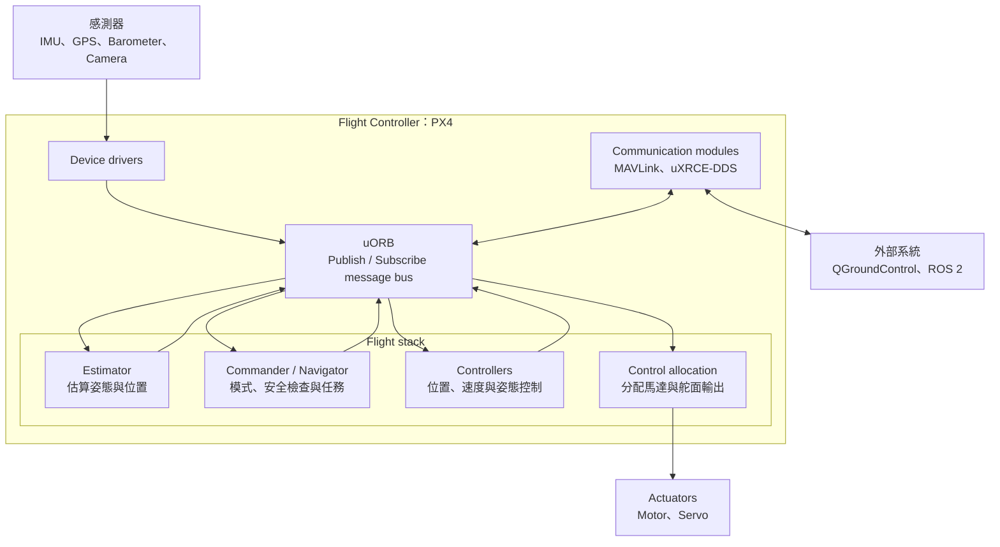
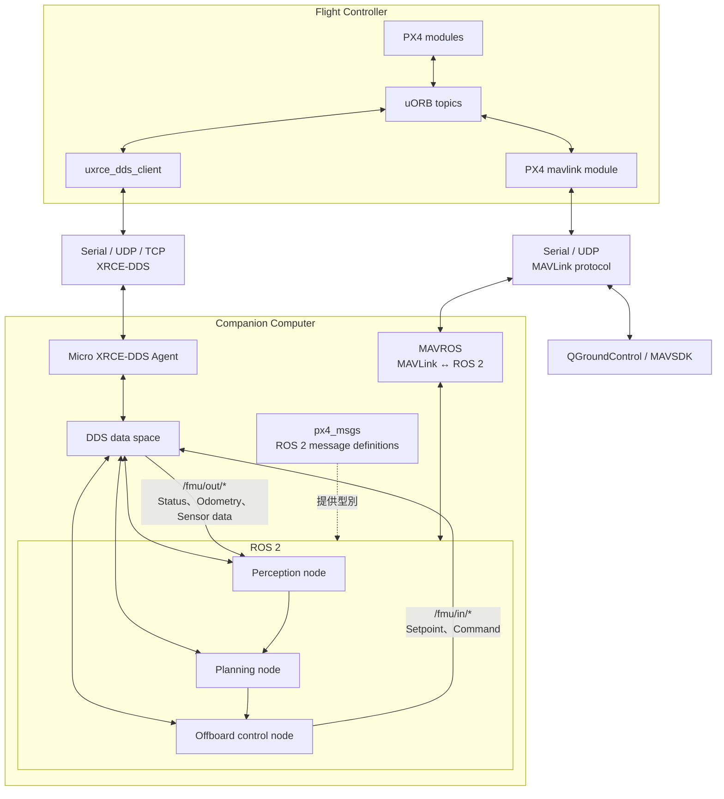

# PX4 介紹

PX4 是一套開源的 autopilot 軟體，主要負責無人機的即時飛行控制。
從作業系統的角度來看，PX4 可以視為一個由多個 module 組成的飛控應用程式。
它可以運行在 Pixhawk 等 flight controller 上，大多使用 NuttX RTOS 系統，
開發與模擬時，也能以 SITL（Software in the Loop）方式在 Linux 或 macOS 電腦中模擬執行。

PX4 適合處理感測器讀取、狀態估測、姿態與位置控制、飛行模式、安全檢查及馬達輸出。
影像辨識、路徑規劃或其他需要較多運算資源的功能，則通常放在 companion computer 上由 ROS 2 執行。

## PX4 軟體架構

PX4 大致分成 flight stack 與 middleware。
Flight stack 包含導航、狀態估測與控制演算法；middleware 則提供 device driver、參數、記錄、對外通訊，以及模組之間使用的 uORB message bus。

uORB 使用 publish/subscribe 通訊方式，但它主要是 PX4 程式內部的訊息匯流排，不是網路通訊協定。
Module 通常透過同一個系統中的共享記憶體交換資料；如果要將資料傳到其他電腦，仍需經過 uXRCE-DDS、MAVLink 等通訊模組。

* Publisher 將資料發布到一個具名 topic，例如 IMU 資料。
* Subscriber 訂閱感興趣的 topic，在資料更新時讀取內容。
* Publisher 和 subscriber 不需要直接認識彼此，因此可以獨立開發及替換。

PX4 的 module 不會彼此直接綁死，而是透過 uORB 發布與訂閱訊息。
例如 driver 發布 IMU 資料，estimator 計算姿態，controller 再根據目標值與估測結果產生控制輸出。
這種方式讓各個 module 可以分開開發或替換。

## PX4 如何與 ROS 2 搭配

最常見的設計是讓 PX4 運行在 flight controller，負責需要即時性與安全性的底層飛行控制；ROS 2 運行在 companion computer，負責感知、規劃和高階任務。

資料傳遞流程如下：

1. PX4 module 在 flight controller 內發布或訂閱 uORB topic。
2. PX4 內的 `uxrce_dds_client` 將指定的 uORB topic 轉換成 DDS 資料。
3. Client 透過 serial、UDP 或 TCP 連接 companion computer 上的 Micro XRCE-DDS Agent。
4. Agent 將資料放入 DDS data space，ROS 2 node 就能使用一般的 publisher 和 subscriber 收發資料。
5. PX4 發出的 ROS 2 topic 通常位於 `/fmu/out/`，ROS 2 要送給 PX4 的 topic 通常位於 `/fmu/in/`。

例如 ROS 2 可以訂閱 vehicle odometry，完成路徑規劃後發布 position setpoint；PX4 接收 setpoint，再由自己的 estimator、controller 和安全機制完成實際飛行控制。

圖中也畫出另一條 MAVLink 路徑。
PX4 的 `mavlink` module 會在 uORB message 與 MAVLink message 之間轉換，再透過 serial 或 UDP 傳送：

* **QGroundControl** 和 **MAVSDK** 可以直接使用 MAVLink 與 PX4 通訊。
* **MAVROS** 是 MAVLink 與 ROS 2 之間的 bridge，會將 MAVLink message 轉換成 ROS 2 topic、service 和 parameter。

因此 ROS 2 有兩種常見連接方式。
uXRCE-DDS 讓 ROS 2 直接使用由 uORB 定義產生的 `px4_msgs`；MAVROS 則使用較通用的 MAVLink message 與 ROS API。
兩條路徑可以同時存在，例如 ROS 2 使用 uXRCE-DDS，而 QGroundControl 同時使用 MAVLink 監控飛行器。

## 各部分的責任

| 部分 | 建議負責的功能 |
| --- | --- |
| PX4 flight controller | 感測器、狀態估測、姿態與位置控制、飛行模式、failsafe、馬達輸出 |
| ROS 2 companion computer | 相機與 LiDAR 處理、定位、避障、路徑規劃、任務邏輯 |
| uXRCE-DDS Client | 在 PX4 上將指定的 uORB topic 與 DDS 資料互相轉換 |
| Micro XRCE-DDS Agent | 代理資源有限的 PX4 client 加入 DDS network |
| `px4_msgs` | 提供 ROS 2 理解 PX4 topic 所需的 message 與 service 型別 |
| PX4 `mavlink` module | 在 uORB message 與 MAVLink message 之間轉換 |
| MAVROS | 在 MAVLink 與 ROS 2 API 之間轉換 |
| QGroundControl | 設定參數、校正、任務規劃、飛行監控及操作 |

ROS 2 不應直接取代 PX4 的高速姿態控制迴路。較常見的做法是由 ROS 2 提供位置、速度、姿態或軌跡 setpoint，再讓 PX4 負責穩定控制與安全檢查。如此即使 companion computer 的高階程式發生問題，PX4 仍能執行既有的 failsafe。

## 其他連接方式

uXRCE-DDS 是 PX4 與 ROS 2 常見且成熟的整合方式。
PX4 也支援使用 Zenoh 將 uORB message 暴露給 ROS 2；另一種選擇是使用 MAVROS，透過 MAVLink 連接 PX4。
選擇時可依現有系統、PX4 版本、網路環境及需要使用的 API 決定。

## 常用資源

* [PX4 官方文件](https://docs.px4.io/main/en/)：安裝、設定、飛行與開發文件。
* [PX4 Architectural Overview](https://docs.px4.io/main/en/concept/architecture)：PX4 flight stack、middleware 與執行模型。
* [PX4 ROS 2 User Guide](https://docs.px4.io/main/en/ros/ros2_comm.html)：ROS 2 環境、通訊與範例。
* [uXRCE-DDS Bridge](https://docs.px4.io/main/en/middleware/uxrce_dds)：Client、Agent、topic 與 QoS 設定。
* [uORB Messaging](https://docs.px4.io/main/en/middleware/uorb)：PX4 內部 publish/subscribe 通訊。
* [PX4-Autopilot](https://github.com/PX4/PX4-Autopilot)：PX4 firmware 原始碼。
* [px4_msgs](https://github.com/PX4/px4_msgs)：PX4 對應的 ROS 2 message 與 service definitions。
