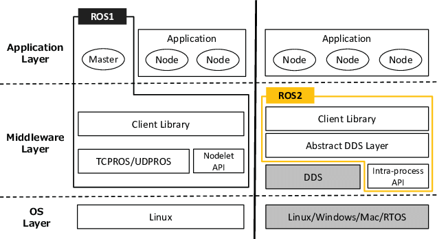

# ROS 2 介紹

隨著 ROS 1 所有版本已經 [EOL (End of Life)](https://www.ros.org/blog/noetic-eol/)，使用 ROS 2 已經是無法避免的趨勢了。
在這邊整理一些跟 ROS 2 相關資訊提供給大家參考。

## Why ROS 2

當初 Open Robotics 為什麼要提出 ROS 2 呢？
一開始 ROS 1 是學術單位所提出來的，然後慢慢擴及到社群和各種機器上面，所以在將機器人產品化的過程上也遇到了很多先天性的限制。
為了解決這些問題，於是提出了 ROS 2 的架構，希望解決如下的問題：

* 多台機器人的協作：未來機器人會從單一轉變成多機，因此能夠新的架構要能考慮到多機的問題
* 適用 embedded 的 ROS 架構：有些機器人可能是跑在資源有限的嵌入式平台上面，因此要能夠讓 footprint 盡可能的減少。
* 擁有 realtime 的能力：在一些用在工業領域上的機器人會需要擁有即時性，確保重要任務可以在一定時限內完成，否則可能會有安全上的疑慮。
* 在網路環境糟糕的情況下仍然可以確保通訊品質：機器人運行的環境不一定是良好的有線網路，需要擁有確保通訊品質的能力。

那為什麼不要修改 ROS 1 架構就好呢？
[官方的說法](https://design.ros2.org/articles/why_ros2.html#why-not-just-enhance-ros-1)是不希望因為架構上的改動而影響到現有的使用者，所以另起爐灶，建立新的架構。
當然 ROS 1 和 ROS 2 還是擁有彼此相互通訊的方法：ROS bridge，未來會再另外說明。

## ROS 2 架構

ROS 1 和 ROS 2 最大的差異在於**通訊方式的改變**，ROS 1 是用 master-client 的架構，所有的 ROS node 都必須要連線到一個 master 上，由這個 master 來協調誰和誰連線，然而在 ROS 2 上面就不須要有 master 的角色了。

在 [Exploring the performance of ROS2](https://www.researchgate.net/publication/309128426_Exploring_the_performance_of_ROS2) 這篇論文裡有一張比較 ROS 1 和 ROS 2 的架構圖：

我們可以看到兩者比較架構中有兩個不同：

1. ROS 1 的 ROS Master 被移除了
2. ROS 2 的底層通訊方式從 TCPROS/UDPROS 轉換成 DDS

ROS 2 架構的特色是把上層應用以及下層網路通訊分開，Open Robotics 希望專注於上層應用的開發，下層則可以借助其他既有已成熟的網路通訊技術，減少重造輪子的工(少掉 ROS 1 的 TCPROS/UDPROS)。
預設的 ROS 2 底層通訊使用了 DDS(Data Distributed Service) 的技術，可以用分散式的方式進行網路通訊。
DDS 的最大特色是不需要擁有中央控管(ROS Master)的角色，每個通訊節點都可以相互溝通，因此在 ROS 上就可以少掉 master 的角色，任何有需要通訊的 ROS node 只要啟動就可以藉由 DDS 來連線到其他的 ROS node 上。

DDS 是一個很複雜的通訊技術，ROS 會選用 DDS 是因為該協定在工業、軍事上面已經擁有悠久可靠的歷史，之後後面會再另外介紹 DDS。

## ROS 2 版本

ROS 2 的版本規則仍然跟 ROS 1 一樣，採取英文字母開頭的方式，用英文的形容詞搭配一隻烏龜的品種。
舉個例子來說，F 版的 ROS 2 正式名稱叫做 Foxy Fitzroy (狡猾的菲茨羅伊河龜)，一般來說我們都稱呼為 foxy 來簡化。

這個命名基本上每次都會在 ROS Discourse 上公開徵選，像是 [ROS 2 F Name Brainstorming](https://discourse.ros.org/t/ros-2-f-name-brainstorming/11081)

到目前為止的 ROS 2 的release版本可以參考[官方網站](https://index.ros.org/doc/ros2/Releases/)。

第一版的 LTS 是 dashing，雖說是 LTS ，不過也只有維護兩年而已，而且很多好用功能和套件支援都有些缺乏，建議使用之後的 LTS 會比較好。

LTS 大多數情況都是兩版出一次，並且搭配 Ubuntu 的 LTS 版本。例如 foxy 搭配 Ubuntu 20.04，humble 搭配 Ubuntu 22.04 等等。最新一版是 jazzy，支援 Ubuntu 24.04。

另外值得一提的是 ROS 2 提出了 rolling version 的概念，除了 LTS 以外，會有一個版本是會不斷進版的，相關資訊可以參考下面連結

* [ROS 2 Rolling distribution plans](https://discourse.ros.org/t/ros-2-rolling-distribution-plans/13227)
* [REP 2002](https://ros.org/reps/rep-2002.html)

## 好用的 ROS 資源

* [ROS Discourse](https://discourse.ros.org/)：ROS 的官方討論區，全世界的 ROS 使用者會在這邊討論 ROS 相關的訊息，或是展現自己的成果
* [Robotics StackExchange](https://robotics.stackexchange.com/)：專門解答 ROS 相關的問題的論壇，過去是 [ROS answer](https://answers.ros.org/questions/)，但後來社群決定和 StackExchange 合併
* [ROS 2 design](https://design.ros2.org/)：ROS 2 當初設計的概念
* [REPs](https://ros.org/reps/rep-0000.html)：Index of ROS Enhancement Proposals，ROS 相關的提案
* [ROS packages](https://index.ros.org/packages/): ROS 現有的 package 列表
* [ROS 2 wiki](https://index.ros.org/doc/ros2/): ROS 2 的 Wiki
* [ROS 2 API List](http://docs.ros2.org/foxy/): ROS 2 的 API 列表
* [ROS 2 Demo Code](https://github.com/ros2/demos): ROS 2 的 Demo Code，通常要寫程式都會從這邊參考
* [ROS 2 Example Code](https://github.com/ros2/examples): ROS 2 的 Example Code，通常要寫程式都會從這邊參考
