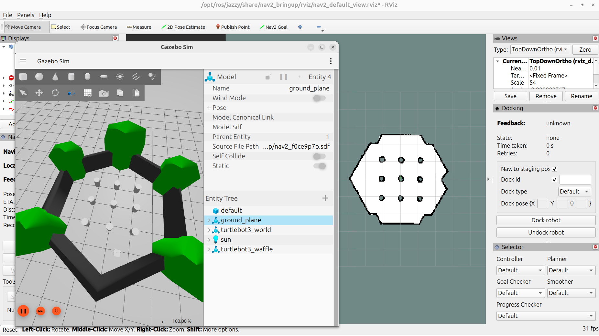
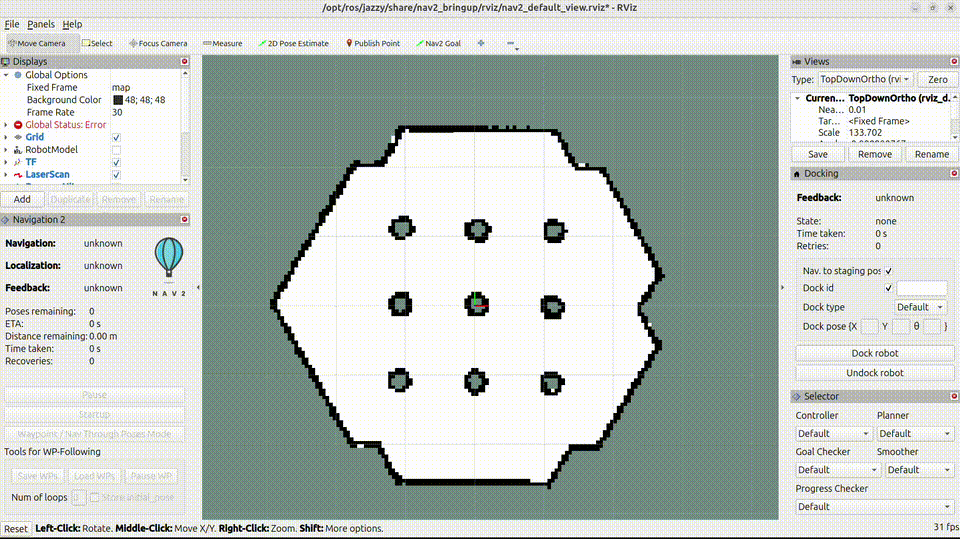

在 ROS 2 中，如果想要打造自主移動式機器人 (Autonomous Mobile Robot, AMR)，基本上離不開 ROS 2 的 navigation2 套件。
navigation2 是由 Open Navigation 所維護，程式碼都在 [GitHub](https://github.com/ros-navigation/navigation2) 上開源。
以下的教學都來自於他們所提供的[官方文件](https://docs.nav2.org/)。

## 安裝

* 首先先確保自己已經安裝 ROS 2 並且 source 環境，這邊以 jazzy 為例

```bash
source /opt/ros/jazzy/setup.bash
```

* 如果我們不需要用最新版的功能，可以直接使用 ROS apt repo 的版本
    * navigation2: 實際的導航程式
    * nav2-bringup: 用來啟動導航、地圖、Rviz、模擬環境或是硬體 driver 的啟動程式，一般來說會是 launch file
    * nav2-minimal-tb*: turtlebot 的模擬硬體和環境

```bash
sudo apt install \
  ros-$ROS_DISTRO-navigation2 \
  ros-$ROS_DISTRO-nav2-bringup \
  ros-$ROS_DISTRO-nav2-minimal-tb*
```

## 使用

* 運行也非常容易，直接執行下面指令即可

```bash
ros2 launch nav2_bringup tb3_simulation_launch.py headless:=False
```

* 會看到模擬環境 Gazebo 和用來顯示的 Rviz 被啟動



* 操作流程
    * 首先先點 Rviz 上面的 2D Pose Estimation，注意位置要對應到 Gazebo 機器人的位置
    * 會看見青色和紫色的 cost map 覆蓋了整個 Rviz 上的地圖，這代表 navigation 成功定位機器人位置了
    * 點選 Rviz 上面的 Nav2 Goal，然後在地圖上紫色的區域拉箭頭，機器人就會自主導航到指定位置
    * 可以看看 Gazebo 上的機器人是不是也有移動到相對應位置
  


* 你可以用另外一個套件 `teleop_twist_keyboard` 來用鍵盤操控機器人
    * `i` 是前進、`j` 和 `l` 分別是左右轉、`,` 是後退、`k` 則是暫停

```bash
# 安裝鍵盤控制程式
sudo apt install ros-jazzy-teleop-twist-keyboard
# 執行
ros2 run teleop_twist_keyboard teleop_twist_keyboard
```
