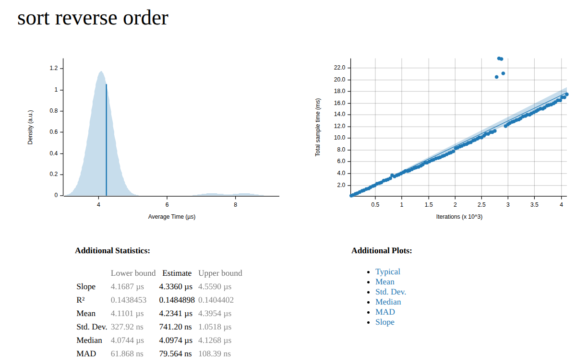

一般效能評測可以大致分成兩類：macrobenchmark 和 microbenchmark。

所謂的 macrobenchmark 是用來量測系統整體效能，例如 throughput、latency 等等。
perf 或 flamegraph 這類的工具可以很好地協助找出系統的 bottleneck。

至於 microbenchmark，則是針對某個函式來評估效能如何。
Rust 內建有 `cargo bench`，可以編譯執行 benchmark target。
一般有兩種測試方式：內建 bench 或是使用 criterion

## 內建 bench

內建 bench 測試通常會在待測 fn 加上 `#[bench]` 這個 attribute。
然而這個功能目前還只是 unstable feature，因此編譯的時候要加上 `+nightly`。

下面是範例

```rust
#[bench]
fn bench_sort_reverse_order(b: &mut Bencher) {
    b.iter(|| {
        let mut data = prepare_numbers();
        sort_numbers(&mut data);
        test::black_box(data);
    });
}
```

完整程式可以參考 [GitHub](https://github.com/evshary/rust-benchmark/tree/main/builtin-bench)

## criterion

大部分的 Rust project 都還是採用 criterion 這個 crate，因為可以避免使用 unstable feature。
而且 criterion 也能提供精美的 report。

```rust
fn bench_sort_reverse_order(c: &mut Criterion) {
    c.bench_function("sort reverse order", |b| {
        b.iter_batched(
            || prepare_numbers(),
            |mut data| sort_numbers(black_box(&mut data)),
            BatchSize::SmallInput,
        )
    });
}

criterion_group!(benches, bench_sort_reverse_order);
criterion_main!(benches);
```

要特別注意的是 `Cargo.toml` 需要 disable default 的 harness。

```toml
[[bench]]
name = "criterion_bench"
path = "benches/criterion_bench.rs"
harness = false
```

完整程式可以參考 [GitHub](https://github.com/evshary/rust-benchmark/tree/main/criterion-bench)

測試完成後我們可以到 [target/criterion/report/index.html] 來查看報告。


