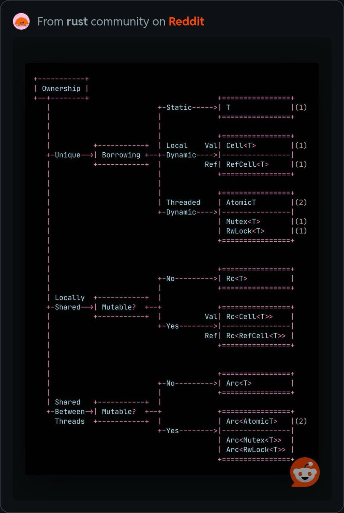

Rust 其中一個很重要的概念是 ownership。
Ownership 代表著有人要專門負責釋放沒有使用的記憶體，而不是靠著手動釋放或是系統的回收機制(Garbage Collection)。
手動釋放的方式（如傳統的 C/C++）容易造成開發者忘記 free，導致有 memory leak 的狀況。
另一方面 Garbage Collection（如 Java）則是因為要定期檢查回收記憶體，造成效能不佳。

透過 ownership 機制，Rust 可以在維持效率的同時，又能確保程式的安全性。

## borrow & own

需要區分 borrow 和 own 兩個概念

1. 如果是 owner，可以對變數做任何事情，因為它會負責釋放
2. 如果是 borrow，那只能讀取變數，不能修改變數
3. 如果是 mutuable borrow，那可以修改變數，但是不能 move / destroy，因為最終還是要還給 owner 的

```rust
struct Basket {
    pub fruit: String,
}
fn try_remove_fruit(b: &mut Basket) {
    //let _fruit = b.fruit;   // 會編譯失敗，因為 b.fruit 會被移走
}
pub fn main() {
    let mut b = Basket { fruit: "Apple".to_owned()};
    try_remove_fruit(&mut b); // 借用 b
    let _fruit = b.fruit;  // 前面儘管有借用，後面 b 還是可以繼續使用
}
```

## mutable & immutable

如果想要取得某個變數的 mutable reference，那個變數一定要是 mutable 的

mutable reference 代表著目前它是唯一的引用，因為沒有其他引用，所以才可以更改該變數

```rust
let mut s = "Hello".to_owned();
// r 不可變，但是指向的內容可以被改變
let r: &mut String = &mut s;
// r 也可變
let mut r: &mut String = &mut s;
```

## 實際使用

### Rc & Arc: shared ownership

雖然每個變數只能有一個 owner，但是總是有需要有多個 owner 的情況，這樣程式也比較好寫

* Rc: single thread 中的 reference counter，可以共享所有權

```rust
use std::rc::Rc;

fn main() {
    let v1 = Rc::new(1);
    let v2 = v1.clone();
    let v3 = v2.clone();
    // v1, v2, v3 都有 ownership
}
```

* Arc: multi-thread 中的 reference counter，A 代表 atomic

如果在多線程的情況，我們需要確保 reference counter 的操作不會有 race condition 的問題，所以要改用 Arc

```rust
use std::sync::Arc;
use std::thread;

fn main() {
    // 用 Arc 包住 data
    let data = Arc::new(5);

    let mut handles = vec![];
    for _ in 0..3 {
        // Clone data，並放入其他 thread
        let data_clone = Arc::clone(&data);
        let handle = thread::spawn(move || {
            println!("value = {}", data_clone);
        });
        handles.push(handle);
    }

    for handle in handles {
        handle.join().unwrap();
    }
}
```

### RefCell: mixed mutable & immutable

RefCell 讓變數擁有內部可變性，也就是讓不可變的值進行可變借用

嚴格來說就是讓擁有者不一定需要有 mutable 才能修改內部，藉此避開只能一個 mutable 的問題(各個擁有者都是 immutable，所以不違反 Rust 原則)

然而實際執行的時候就會真的見真章了，runtime 還是會檢查 mutable 和 immutable 混用的問題

```rust
use std::cell::RefCell;

fn main() {
    let v = RefCell::new(vec![1, 2, 3]);
    v.borrow_mut().push(4);
    for val in v.borrow().iter() {
        println!("{}", val);
    }
}
```

## Rc + RefCell 共同使用

參考 [Rust 語言聖經: Cell & RefCell](https://course.rs/advance/smart-pointer/cell-refcell.html)

| Rust 規則 | Wrapper 帶來的改變 |
| - | - |
| 每個資料只能有一個擁有者 | Rc/Arc 可以讓資料有多個擁有者 |
| 只能一個 mutable 或是多個 immutable | RefCell 可以作到 compile 時 mutable 和 immutable 共存，但是 runtime 如果錯誤會 panic |

```rust
use std::cell::RefCell;
use std::rc::Rc;
fn main() {
    let s = Rc::new(RefCell::new("Hello".to_owned()));

    // 產生多個 owner
    let s1 = s.clone();
    let s2 = s.clone();
    // 針對其中一個 owner 進行 mutable borrow
    s2.borrow_mut().push_str(" World!");

    println!("{:?}\n{:?}\n{:?}", s, s1, s2);
}
```

## 各種組合

這些概念單一來看其實都很簡單，但是組合在一起就會變得複雜，有時候我們也都不知道什麼情境該用什麼樣的組合。
下面有一張在 Reddit 上很好的圖，可以總結 Ownership 搭配各個 smart pointer 的使用



一般 Unique 的情況就是遵守 Rust 的 ownership 機制，只能有單一個擁有者。
如果要有多個擁有者，那就必須要根據是否為多線程來決定使用 Rc 還是 Arc。

除了 Ownership，還有個概念就做 Accessibility，代表誰可以去存取這個變數。
在 Unique 情況下，我們不需要有 Ownership，可以用 borrow 的方式來存取。
然而如果是在單一線程下，我們想要多一點彈性，不要編譯器幫我們做 accessibility 的檢查，這時候就需要使用 Cell 或 RefCell。
而在多線程的情況，那就必須要使用 Atomic、Mutex、或是 RwLock 了。
