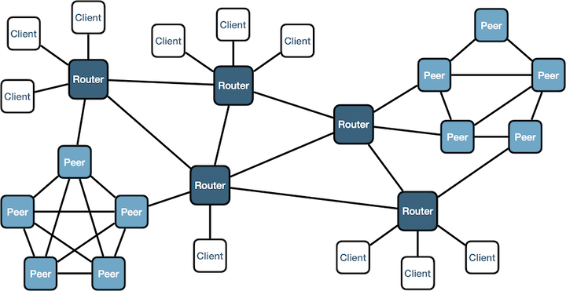

# Zenoh 介紹

Zenoh 是 [ZettaScale](https://www.zettascale.tech/) 所開發出的開源通訊軟體，目前和 CycloneDDS 一樣託管於 [Eclipse Foundation 底下](https://projects.eclipse.org/projects/iot.zenoh)。

Zenoh 和 DDS 類似，是一個通訊層的 middleware，可以幫助開發者更容易的交換資訊。
由於 ZettaScale 內部有許多當初設計 DDS 的研究人員，很清楚 DDS 本身的限制，為了避開這些問題，才特別設計新的協定。

具體 DDS 有哪些問題呢？

* DDS 並不能支援跨網域的傳輸，只能在 LAN
* DDS 強烈依賴 multicast，無法在沒有 multicast 的環境執行，例如 4G 或 5G
* DDS 一開始並非為了無線網路設計，所以不限制流量的話，他的 discovery 的機制會讓無線網路癱瘓
* DDS 實作很複雜，通常無法跑在嵌入式系統上

Zenoh 則是另起爐灶，在保留 DDS 去中心化和高效能的同時，也結合了中心化通訊的機制。
可以看看下面這張圖：

這邊有三種角色

* Peer：通常在本地端執行，一般設定都是可以直接去中心化通訊
* Router：當要連接到遠端時(跨網域)，會使用 router 來避免 discovery 封包擴散整個網路
* Client：最簡化、少功能的 Zenoh 執行單位，使用的資源最少

可以看得出 Zenoh 的三種角色就是專門為了不同情境來設計。

## Repository

Zenoh 的 [GitHub namepace](https://github.com/eclipse-zenoh) 裡面底下有很多 project，下面列出幾個常用的

* [zenoh](https://github.com/eclipse-zenoh/zenoh)：zenoh 本身的主程式
* [zenoh-plugin-dds](https://github.com/eclipse-zenoh/zenoh-plugin-dds)：結合 zenoh 和 DDS，將兩者的資料互相轉換
* [zenoh-plugin-ros2dds](https://github.com/eclipse-zenoh/zenoh-plugin-ros2dds)：雖然也是跟 DDS 相連，但是這特別限定是用在 ROS 2 的情境下
* [zenoh-pico](https://github.com/eclipse-zenoh/zenoh-pico)：用在嵌入式環境的專案

如果你想了解還有哪些其他 project 使用 Zenoh，可以參考這邊

* [awesome-zenoh](https://github.com/kydos/awesome-zenoh)
