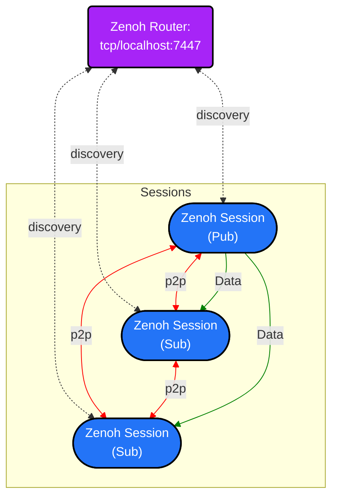

# rmw_zenoh 基本介紹

為何有 [rmw_zenoh](https://github.com/ros2/rmw_zenoh) 的出現呢？
主要原因是 ROS 2 社群發現 DDS 使用上遇到很多問題，特別是關於機器人無線網路應用的部份，畢竟當初 DDS 就不是為了無線環境來設計的。
經過社群的[評估和投票](https://discourse.openrobotics.org/t/ros-2-alternative-middleware-report/33771
)，最終決定採用 Zenoh 來作為第一個非 DDS 的官方 RMW (ROS MiddleWare) 支援。

ROS 2 當初的設計就已經考慮到替換中間層 (Middleware) 的可能，因此剩下的問題就是開發 rmw_zenoh 這個中間層，即可連接 ROS 和 Zenoh。

目前 rmw_zenoh 從 Kilted 開始已經是 ROS 官方的 [Tier 1 支援](https://www.ros.org/reps/rep-2000.html#kilted-kaiju-may-2025-november-2026)，並且向前兼容 (backport) 到 ROS 2 Humble。
基本上代表 ROS 2 目前還有維護的版本都可以使用 rmw_zenoh。

## 安裝

安裝 rmw_zenoh 最簡單的方法是直接針對 ROS 的版本來 `apt install`。

```bash
# 用 ROS_DISTRO 看你使用的 ROS 版本為何
sudo apt install ros-${ROS_DISTRO}-rmw-zenoh-cpp
```

當然，如果你想要使用 rmw_zenoh 最新版本也可以從 source code 來編譯安裝。

```bash
mkdir ~/ws_rmw_zenoh/src -p && cd ~/ws_rmw_zenoh/src
# 切換到對應 ROS 版本的 branch
git clone https://github.com/ros2/rmw_zenoh.git -b ${ROS_DISTRO}
cd ~/ws_rmw_zenoh
rosdep install --from-paths src --ignore-src --rosdistro ${ROS_DISTRO} -y
colcon build --cmake-args -DCMAKE_BUILD_TYPE=Release
source install/local_setup.bash
```

## 使用

我們這邊以最經典的 ROS talker 和 listener 為例，來講解 rmw_zenoh 的使用。

* 首先我們在第一個 terminal 啟動 zenohd，或者說 Zenoh Router，我們會在後面講解其功能。

```bash
ros2 run rmw_zenoh_cpp rmw_zenohd
```

* 接下來在第二個 terminal 啟動 talker，注意這邊我們需要修改 `RMW_IMPLEMENTATION`，讓 ROS 2 系統知道我們要使用 rmw_zenoh。

```bash
export RMW_IMPLEMENTATION=rmw_zenoh_cpp
ros2 run demo_nodes_cpp talker
```

* 最後就是在第三個 terminal 跑 listener 了，跟前面一樣要修改 `RMW_IMPLEMENTATION`。

```bash
export RMW_IMPLEMENTATION=rmw_zenoh_cpp
ros2 run demo_nodes_cpp listener
```

從上面的範例，你可以看到使用 rmw_zenoh 需要多兩個動作：

1. 啟動 Zenoh Router： `ros2 run rmw_zenoh_cpp rmw_zenohd`
2. 指定 `RMW_IMPLEMENTATION`： `export RMW_IMPLEMENTATION=rmw_zenoh_cpp`

剩餘行為都跟原來 ROS 2 系統相同，非常容易使用。

## 架構

接下來讓我們了解一下 rmw_zenoh 的設計架構，這邊會建議先了解之前的 Zenoh 架構再來看會更清楚一點。

根據 rmw_zenoh 的[設計文件](https://github.com/ros2/rmw_zenoh/blob/rolling/docs/design.md)，預設每個 ROS 本機系統都會運行一個 Zenoh Router。
這個 Zenoh Router 的用途有兩個

1. 幫助本地端的節點間互相發現，彼此建立連線
2. 本地端要連到外部的時候，充當 Gateway 的角色，轉發訊息



從上面架構圖你可以發現，對於本機端的各個節點，例如 publisher 和 subscriber，他們首先會透過 Zenoh Router 找到對方，然後再彼此建立直接溝通的連線。
這與 DDS 可以直接點對點發現彼此的設計很不一樣，因為這種機制會造成網路上充滿著一堆發現封包 (Discovery Packets)，進而癱瘓網路。
因此儘管 Zenoh 也支援直接的點對點發現，但最終還是決定在 rmw_zenoh 中還是採用集中式的發現機制，只有實際資料的傳輸才是點對點的直接連線。

!!! note
    也許有人會問到這不是又回到 ROS 1 的集中式老路了嗎？
    這有點不一樣，ROS 1 的 roscore 一旦掛掉，基本上就需要所有 ROS 的節點都要重新啟動。
    但是在 rmw_zenoh 中，我們可以隨時關掉重啟 zenoh，而不會對當下系統有任何影響。
    更別說我們還可以在 zenohd 上面做一些網路流量的管理了，後面我們會有更深入的探討。
